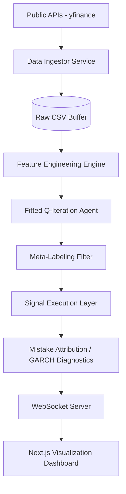

# Architecture Document - Hybrid Temporal Forecaster

## 1. System Overview
The Hybrid Temporal Forecaster uses a layered microservices architecture to decouple data ingestion, model inference, and the visualization frontend.

## 2. High-Level Architecture

## 3. Component Details
- **Data Ingestor**: Runs daily/hourly to fetch OHLCV.
- **Feature Engine**: Applies Fractional Differentiation and CUSUM filters.
- **Model Server**: Serves Model A (Daily) and Model B (Hourly).
- **Web Dashboard**: Displays live equity curves and prediction error logs.

## 4. Communication Protocol
- Internal components communicate via REST/gRPC.
- Web client receives live updates via WebSockets for "Live Prediction" feel.

## 5. Mistake Attribution Logic
When a prediction fails, the GARCH diagnostic unit analyzes the residuals. If ARCH effects are present, the system flags a "Regime Shift Error," notifying the user that the current model is under-specified for the new volatility regime.
