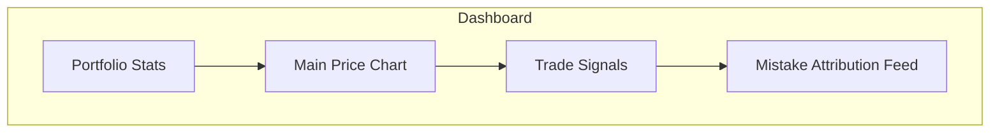

# Design Document - Prediction Dashboard

## 1. UI/UX Principles
- **Clarity over Complexity**: Financial data is dense; we use high-contrast dark modes with vibrant signal indicators (Green/Red).
- **Real-time Feedback**: Every prediction is accompanied by a confidence score from the Meta-Labeling layer.
- **Explainability**: "Why did this trade happen?" tooltips on every signal.

## 2. Page Layout
- **Header**: Global portfolio ROI, Sharpe Ratio, and Current Regime Status (e.g., "High Volatility - Defensive Mode").
- **Main Chart**: Candlestick chart overlaid with Triple Barrier levels and predicted paths.
- **Error Log**: A scrolling feed of "attribution markers" explaining model performance vs. reality.

## 3. Visual Language
- **Signal Nodes**: Buy (+1), Sell (-1), Hold (0).
- **Uncertainty Bands**: Shaded regions representing the confidence interval of the Q-function.

## 4. Mockup (Mermaid Layout)

