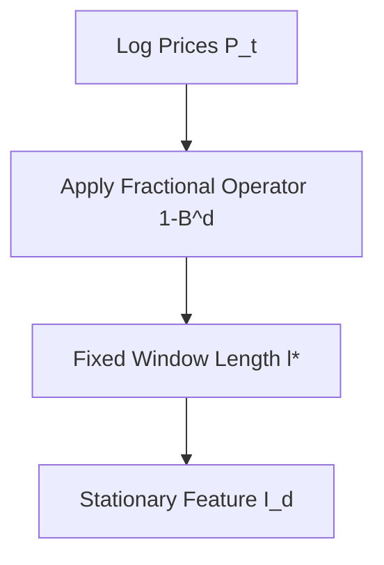
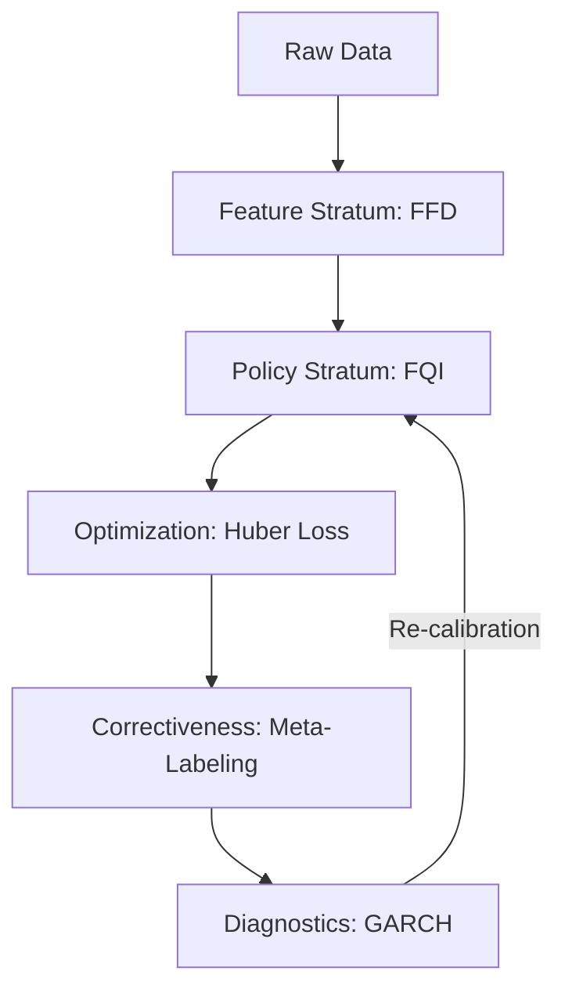

# Literature Review - Hybrid Reinforcement Learning in Non-Stationary Financial Markets

## Abstract
The trajectory of quantitative finance over the past six decades reflects a persistent struggle to reconcile elegant mathematical abstractions with the chaotic, non-stationary reality of global markets. This report provides an exhaustive review of these developments, tracing the path from foundational asset pricing to the sophisticated hybrid temporal forecasters that define the modern era of algorithmic trading.

## 1. Foundational Theory: The Evolution of Asset Pricing Models
The intellectual architecture of modern finance was established during a period of relative market stability, leading to models that prioritized mathematical tractability and equilibrium.

### 1.1 The Efficient Market Hypothesis and the Rise of CAPM
The Capital Asset Pricing Model (CAPM), introduced in the early 1960s, was the first successful attempt to quantify the relationship between risk and expected return. Rooted in the Efficient Market Hypothesis (EMH).

$$E[r_i] = r_f + \beta_i(E[r_M] - r_f)$$

### 1.2 Empirical Failures and the Shift to Multi-Factor Models
By the 1980s and 1990s, the Fama-French Three-Factor Model (FFM) expanded CAPM to include SMB (Size) and HML (Value) factors.

| Model | Primary Factors | Contributions | Identified Weaknesses |
|:---|:---|:---|:---|
| CAPM (1960s) | Market Beta | Linear risk-return relationship | Fails at size/value anomalies. |
| FF3 (1993) | Mkt, SMB, HML | Captures size and value premiums | Ignores momentum factor. |
| FF5 (2015) | FF3 + RMW, CMA | Adds profitability and investment | Potential tautology. |

## 2. Feature Engineering Breakthroughs: Navigating Memory and Stationarity

### 2.1 The Conflict of Integer Differentiation
Financial time series are typically non-stationary ($I(1)$). Standard integer differentiation ($d=1$) removes memory.

### 2.2 Fractional Differentiation (FFD)
Marcos López de Prado championed Fractional Differentiation to resolve the "memory vs. stationarity" dilemma.

## 3. Non-Neural Reinforcement Learning
Using tree-based ensemble methods like **Extra-Trees** for FQI provides robustness, interpretability, and sample efficiency over neural networks.

## 4. Robust Optimization: Huber Loss
To handle fat-tailed distributions (Leptokurtosis), we use the Huber Loss:

$$ L_{\delta}(a) =\begin{cases}\frac{1}{2} a^2 & \text{for } |a| \le \delta \\ \delta(|a| - \frac{1}{2}\delta) & \text{otherwise}\end{cases} $$

## 5. Failure Analysis: GARCH and Meta-Labeling
- **GARCH**: Monitoring volatility clustering and regime shifts.
- **Meta-Labeling**: Decoupling directional "Side" from position "Size."

## 6. Synthesis: The Modern Hybrid Temporal Forecaster

## Conclusion
The modularity of the modern hybrid temporal forecaster—separating feature engineering, policy discovery, and bet sizing—achieves institutional-grade robustness.
