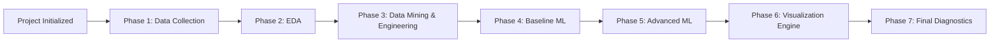

# Literature Review - Hybrid Reinforcement Learning in Non-Stationary Financial Markets

## Abstract
The trajectory of quantitative finance over the past six decades reflects a persistent struggle to reconcile elegant mathematical abstractions with the chaotic, non-stationary reality of global markets. This report provides an exhaustive review of these developments, tracing the path from foundational asset pricing to the sophisticated hybrid temporal forecasters that define the modern era of algorithmic trading.

## 1. Foundational Theory: The Evolution of Asset Pricing Models

### 1.1 The Efficient Market Hypothesis and the Rise of CAPM
The Capital Asset Pricing Model (CAPM), introduced in the early 1960s, was the first successful attempt to quantify the relationship between risk and expected return. Rooted in the Efficient Market Hypothesis (EMH), it posits that expected return $E[r_i]$ is a linear function of systematic risk $\beta$:

$$E[r_i] = r_f + \beta_i(E[r_M] - r_f)$$

### 1.2 Empirical Failures and the Shift to Multi-Factor Models
The Fama-French Three-Factor Model (1993) and the subsequent Five-Factor Model (2015) addressed CAPM anomalies like the size and value effects.

| Model | Primary Factors | Core Assumptions | Identified Weaknesses |
|:---|:---|:---|:---|
| CAPM (1960s) | Market Beta | Linear risk-return relationship | Fails to explain size and value anomalies |
| FF3 (1993) | Mkt, SMB, HML | Captures size and value premiums | Ignores momentum and low volatility |
| FF5 (2015) | Mkt, SMB, HML, RMW, CMA | Adds profitability and investment | Potential tautology; increased complexity |

## 2. Feature Engineering: Memory and Stationarity

A critical barrier in financial ML is the non-stationarity of price series.

### 2.1 The Conflict of Integer Differentiation
Traditionally, practitioners use integer differentiation ($d=1$) to achieve stationarity, but this wipes out "memory." 

### 2.2 Fractional Differentiation (FFD)
Marcos López de Prado championed fractional differentiation ($0 < d < 1$) using non-local operators to preserve maximum memory while passing stationarity tests (ADF).

```mermaid
graph TD
    A[Raw Market Data] --> B[Feature Stratum]
    B --> C[Fractional Differentiation <br/>(Memory Preservation)]
    C --> D[Policy Stratum]
    D --> E[Fitted Q-Iteration <br/>(FQI + Extra-Trees)]
    E --> F[Optimization Stratum]
    F --> G[Huber Loss <br/>(Outlier Robustness)]
    G --> H[Corrective Stratum]
    H --> I[Meta-Labeling <br/>(Recall/Precision Optimization)]
    I --> J[Diagnostic Stratum]
    J --> K[GARCH Residual Tests <br/>(Regime Monitoring)]
    K --> L[Model Execution/Correction]
```

## 3. Non-Neural Reinforcement Learning

### 3.1 Fitted Q-Iteration (FQI)
FQI is a model-free, off-policy batch RL algorithm that learns from historical $(s_t, a_t, r_t, s_{t+1})$ transitions.

### 3.2 Extremely Randomized Trees (Extra-Trees)
Extra-Trees offer superior robustness over neural networks in financial contexts due to variance reduction and sample efficiency.

## 4. Robust Optimization: Huber Loss
To handle the leptokurtic nature of returns, we use **Huber Loss**, which is quadratic for small errors and linear for large errors (outliers).

$$ L_{\delta}(a) =\begin{cases}\frac{1}{2} a^2 & \text{for } |a| \le \delta \\ \delta(|a| - \frac{1}{2}\delta) & \text{otherwise}\end{cases} $$

## 5. Failure Analysis and Meta-Labeling
- **GARCH**: Monitoring volatility clustering and regime shifts.
- **Meta-Labeling**: A secondary corrective layer that decoupling "Side" (direction) from "Size" (confidence).

## Conclusion
The evolution of financial modeling from static equilibrium to adaptive hybrids reflects a maturation of the field. The modularity of the modern hybrid temporal forecaster—separating feature engineering, policy discovery, and bet sizing—achieves institutional-grade robustness.

---
*Roadmap Overview:*


