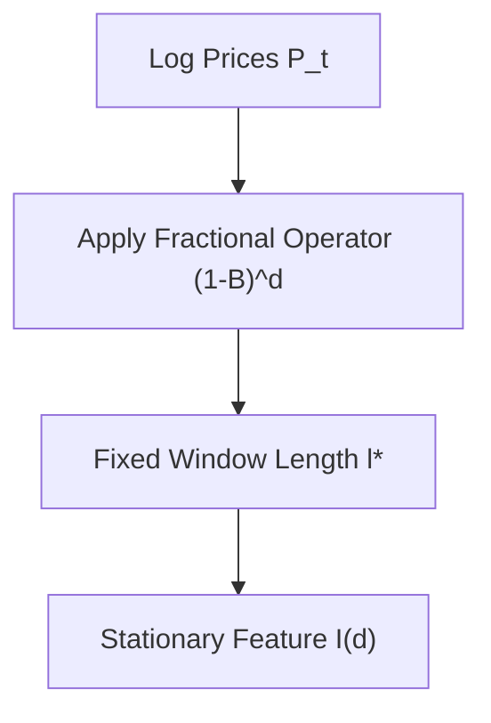
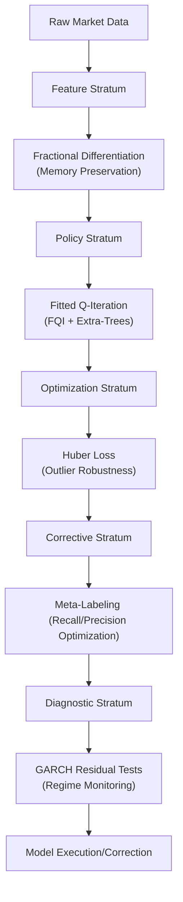

# Literature Review - Hybrid Reinforcement Learning in Non-Stationary Financial Markets: A Multi-Decadal Review (1960--2024)

## Abstract
The trajectory of quantitative finance over the past six decades reflects a persistent struggle to reconcile elegant mathematical abstractions with the chaotic, non-stationary reality of global markets. From the early equilibrium theories of the 1960s to the adaptive, non-neural reinforcement learning frameworks of 2024, the field has undergone a series of paradigm shifts.

## 1. Introduction
The intellectual architecture of modern finance was established during a period of relative market stability, leading to models that prioritized mathematical tractability and equilibrium. However, as empirical evidence mounted, those limitations became apparent.

## 2. Foundational Theory: The Evolution of Asset Pricing Models

### 2.1 The Efficient Market Hypothesis and the Rise of CAPM
The Capital Asset Pricing Model (CAPM) introduced in the 1960s posits that the expected return of an asset is a linear function of its systematic risk ($\beta$):
$$E[r_i] = r_f + \beta_i(E[r_M] - r_f)$$

### 2.2 Empirical Failures and Multi-Factor Models
The Fama-French Three-Factor Model (1993) added SMB (Size) and HML (Value) factors.

| Model | Primary Factors | Contributions | Identified Weaknesses |
|:---|:---|:---|:---|
| CAPM (1960s) | Market Beta | Linear risk-return | Fails at anomalies. |
| FF3 (1993) | Mkt, SMB, HML | Captures size/value | Ignores momentum. |
| FF5 (2015) | FF3 + RMW, CMA | Adds profitability | Potential tautology. |

## 3. Feature Engineering Breakthroughs: Memory and Stationarity

### 3.1 The Conflict of Integer Differentiation
Financial series are typically $I(1)$ (non-stationary). Standard $d=1$ differentiation removes "memory".

### 3.2 Fractional Differentiation (FFD)
Marcos López de Prado pioneered $(1 - B)^d$ to preserve maximum memory while passing stationarity tests.

## 4. Non-Neural Reinforcement Learning
Fitted Q-Iteration (FQI) with Extremely Randomized Trees (Extra-Trees) provides robustness, interpretability, and sample efficiency over deep learning in noisy financial data.

## 5. Robust Optimization: Handling Leptokurtic Distributions
Financial returns exhibit fat tails. Standard MSE is sensitive to outliers. We use **Huber Loss**:

$$ L_{\delta}(a) =\begin{cases}\frac{1}{2} a^2 & \text{for } |a| \le \delta \\ \delta(|a| - \frac{1}{2}\delta) & \text{otherwise}\end{cases} $$

## 6. Failure Analysis: Detecting Specification Errors
- **GARCH**: Monitoring volatility clustering.
- **Residual Diagnostics**: Ljung-Box and ARCH-LM tests to identify regime shifts.

## 7. Corrective AI: Meta-Labeling
Meta-labeling decouples trade direction (side) from trade magnitude (sizing).

## 8. Synthesis: The Modern Hybrid Temporal Forecaster

## Conclusion
The modularity of the modern hybrid temporal forecaster—separating feature engineering, policy discovery, and bet sizing—achieves institutional-grade robustness.
